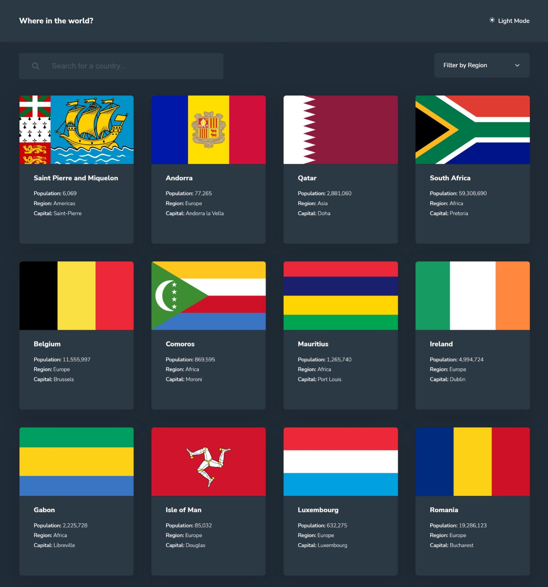
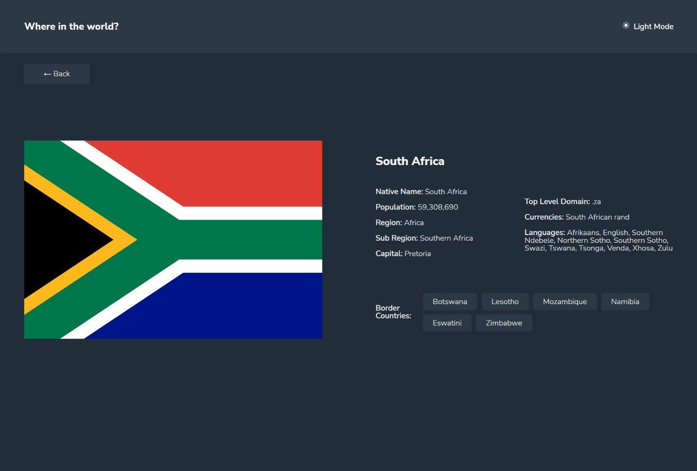
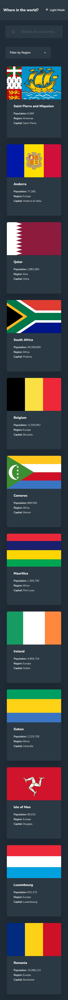
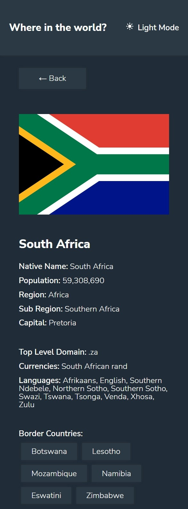

# Frontend Mentor - REST Countries API with color theme switcher solution

This is a solution to the [REST Countries API with color theme switcher challenge on Frontend Mentor](https://www.frontendmentor.io/challenges/rest-countries-api-with-color-theme-switcher-5cacc469fec04111f7b848ca). Frontend Mentor challenges help you improve your coding skills by building realistic projects.

## Table of contents

- [Overview](#overview)
  - [The challenge](#the-challenge)
  - [My Approach](#my-approach)
  - [Screenshot](#screenshot)
  - [Links](#links)
- [My process](#my-process)
  - [Built with](#built-with)
  - [What I learned](#what-i-learned)
  - [Continued development](#continued-development)
  - [Useful resources](#useful-resources)
- [Author](#author)

## Overview

### The challenge

Users should be able to:

- See all countries from the API on the homepage
- Search for a country using an `input` field
- Filter countries by region
- Click on a country to see more detailed information on a separate page
- Click through to the border countries on the detail page
- Toggle the color scheme between light and dark mode

### My Approach

I wanted to build this app using nothing, but plain HTML, CSS and Javascript. I took a mobile first approach. First created the HTML and the template for the countries, then the layout and styling, lastly the Javascript. Once that was done, I moved onto creating the individual country modals, using the same approach.

### Screenshot

 

 

### Links

- Live Site URL: [The Site](https://bence-restcountriesapi.netlify.app/)

## My process

### Built with

- HTML5
- CSS3
- JS (ES6)
- Mobile-first workflow
- [Ion Icons](https://ionic.io/ionicons) - For Icons

### What I learned

This project became much larger, than I anticipated. I've learnt and practiced a lot, here are a few things I practiced:

- CSS layouts and styling (grid, flexbox)
- API call with async/await
- API response handling
- Object iterations
- Array iterations
- Optional chaining (?.)
- Nullish coalescing operator (??)
- Intersection Observer

Example:

```js
const parent =
	e.target.closest(".country") ??
	countriesArr
		.filter(
			(el) =>
				el.querySelector(".country-name").textContent.toLowerCase() ===
				e.target.textContent.toLowerCase()
		)
		.pop();
```

```js
data[country].tld?.join(" ") ?? "None";
```

### Continued development

I didn't anticipate the code size to be this large, it would be wiser to divide my CSS and JS into multiple files and use a code architecture like MVC.
Also I would like to take on a more non-mutating approach, when it comes to JS functions.

Going forward I'd like to implement:

- Code Architecture
- Frameworks
- Simpler function designs

### Useful resources

- [MDN](https://developer.mozilla.org/en-US/) - I spent most of my time reading through documentation on MDN.

## Author

Bence Meszaros

- Website - "Coming Soon"
- Frontend Mentor - [@BenceM](https://www.frontendmentor.io/profile/BenceM)
- GitHub - [@BenceM](https://github.com/BenceM)
